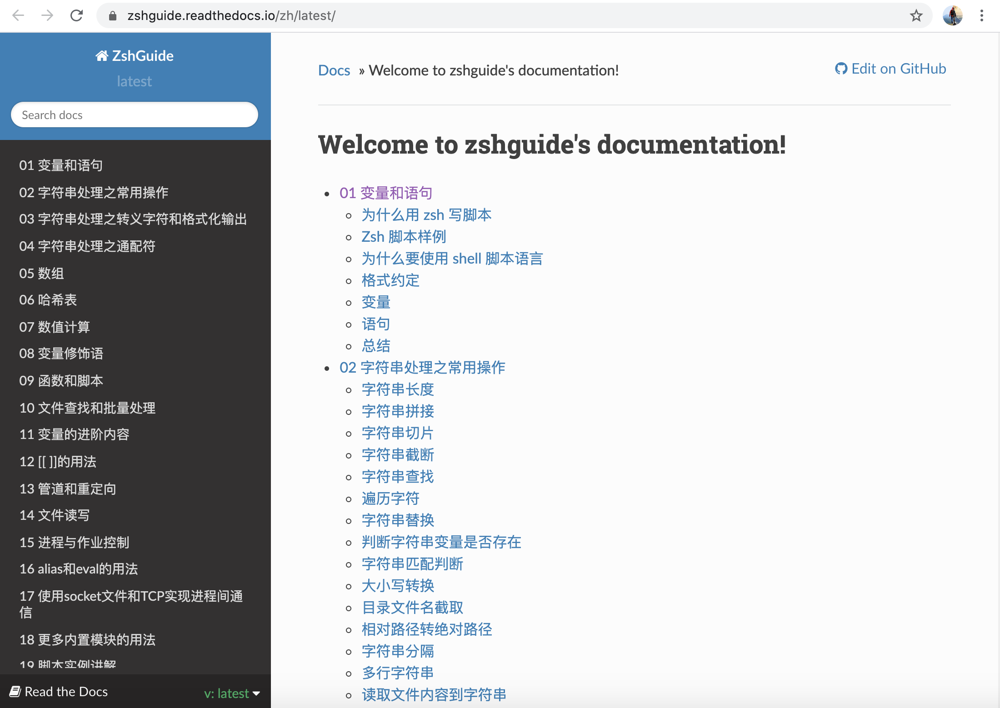
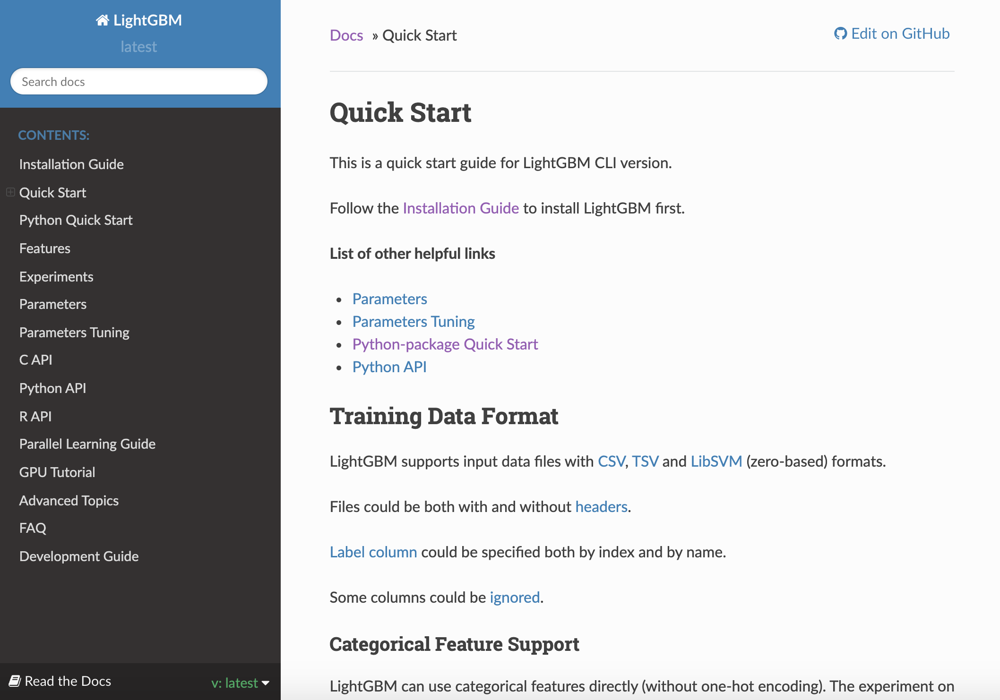
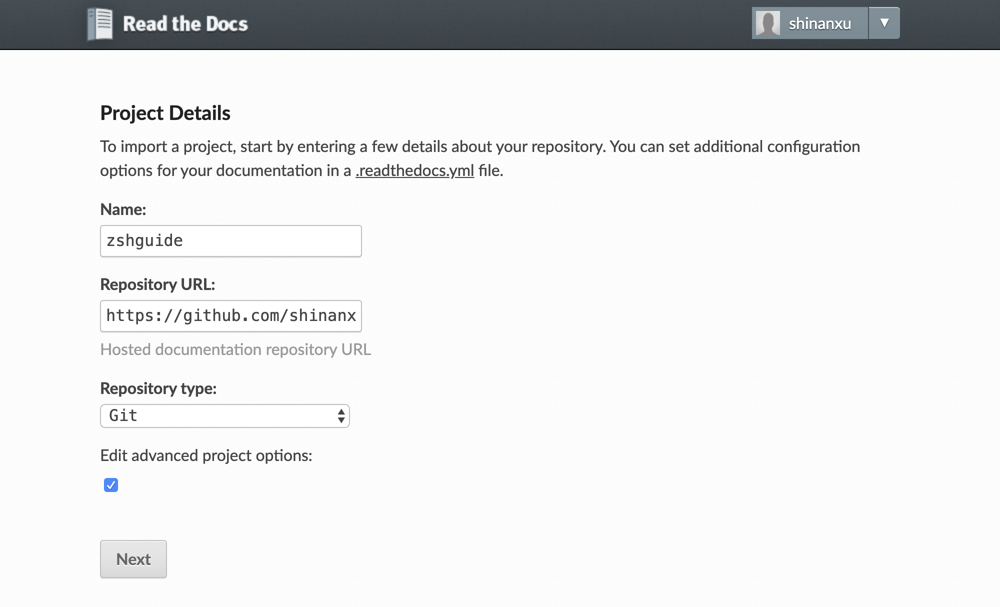
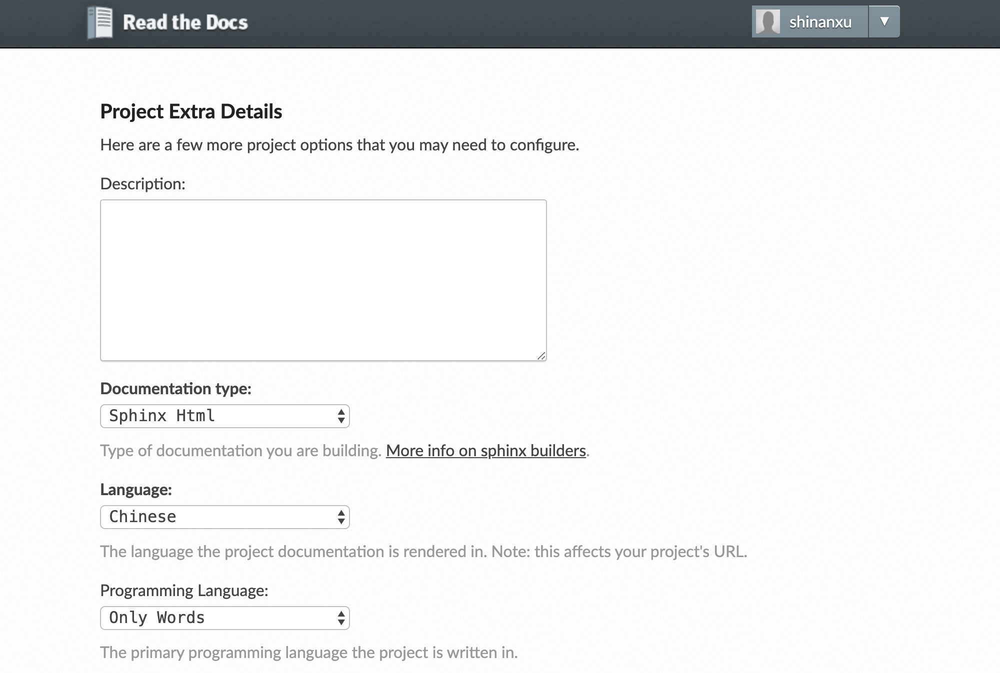

# Publish Docs to ReadtheDocs

如何发布一本书到 ReadtheDocs

RedtheDocs 是一家在线文档托管平台，可以从 Github 导入 repo，并在每次提交代码后自动构建上传至 readthedocs.io 网站。早期多用来生成 Python 的官方文档，现在越来越多的知名项目也用它来发布文档，甚至可以用它来写书。

本文使用 Sphinx + GitHub + ReadtheDocs 作为文档写作发布工具，用 Sphinx 生成文档，GitHub 托管源文件，再通过 ReadtheDocs 发布。[效果](https://zshguide.readthedocs.io/zh/latest/)如下：



书籍为 [goreliu](https://github.com/goreliu) 所写的 *[《Zsh开发指南》](https://github.com/goreliu/zshguide)*，我个人微小的工作仅为将其发布到 ReadtheDocs 网站，以提供更好的在线阅读体验。书籍版权归原作者所有。[Github 项目](https://github.com/shinanxu/zshguide)、[ReadtheDocs项目](https://readthedocs.org/projects/zshguide/) 链接可以在本文末尾「相关」部分找到。

## 1. 初窥 Sphinx

### 1.1 安装 Sphinx

Sphinx 是一个基于 Python 的文档生成工具，由于日常习惯使用 conda 对 python 进行包管理，直接使用 conda 安装 Sphinx：

```shell
# conda create -n book python=3.7
# conda activate book
conda install sphinx
```

如有必要，也可以创建一个新的 conda 环境再安装 Sphinx 和相关包。如果想使用 apt、brew 或者 docker 安装 Sphinx，可以查看 [Sphinx 安装文档](https://www.sphinx-doc.org/en/master/usage/installation.html)。

### 1.2 快速上手 Sphinx

想要快速上手 Sphinx 非常简单，先来创建一个 Sphinx 的工程：

``` shell
mkdir test_doc
cd testdoc
sphinx-quickstart
```

初始化项目时，有几个关键的选项如下：

``` tex
> 独立的源文件和构建目录（y/n） [n]: y
Separate source and build directories (y/n) [n]: y 
> 项目语种 [en]: zh_CN
Project language [en]: zh_CN
```

建议选择「独立的源文件和构建目录」，即在项目根目录下创建 `source` 和 `build` 两个独立的文件夹。`source` 用于存放文档的源文件，通常为 rst 或 md 格式；`build` 用于存放生成的 html 文件。初始化时完整的配置选项可见 [sphinx-quickstart-log.txt](./sphinx-quickstart-log.txt)。

可以看到生成的 Sphinx 结构如下：

```tex
.
├── build
├── make.bat
├── Makefile
└── source
    ├── conf.py
    ├── index.rst
    ├── _static
    └── _templates
```

之后我们重点需要修改的就是`source/`路径下：

- `conf.py` : 用于配置项目
- `index.rst` : 用于生成文档目录

### 1.3 生成 html

在 `source` 目录下新建文件 `chaper01.rst` 并写入内容:

``` shell
touch source/chaper01.rst
echo "Hello World\n============="
```

Sphinx 默认使用 [reStructureText](https://docutils.sourceforge.io/rst.html) 作为文档的写作语言，上述「=============」的写法就是 reStructureText 的语法。如果你更习惯 Markdown，稍后在 2.2 节中会说明如何配置 Markdown 作为写作语言。

将 chapter01 加入到目录树中，修改 `index.rst`：

```rst
Contents:
.. toctree::
   :maxdepth: 2

   chaper01
```

生成 html 文件：

``` shell
make html
```

此时， `build/html` 路径下已生成 index.html、chapter01.html 页面。

## 2. 项目配置

### 2.1 rtd 主题

修改主题为 ReadtheDocs 的默认主题，先安装通过 conda 安装 sphinx_rtd_theme：

``` shell
conda install sphinx_rtd_theme
```

再在 `source/conf.py` 配置文件中添加：

```python
import sphinx_rtd_theme
html_theme = "sphinx_rtd_theme"
html_theme_path = [sphinx_rtd_theme.get_html_theme_path()]
```



<!--sphinx_rtd_theme 主题示意图-->

### 2.2 markdown 支持

安装 [recommonmark](https://github.com/readthedocs/recommonmark) 使 Sphinx 兼容 Markdown：

``` shell
conda install recommonmark
```

修改配置文件 `source/conf.py`：

``` python
# for Sphinx-1.4 or newer
import recommonmark
source_suffix = ['.rst', '.md']
extensions = ['recommonmark']
```

recommonmark 还提供了 [AutoStructify](https://github.com/readthedocs/recommonmark#autostructify)，可在 build 时自动将 md 转换成 rst 格式。

### 2.3 table 兼容性

由于 recommonmark 并没有提供对 Markdown 表格的支持，我门需要安装第三方模块 [sphinx-markdown-tables](https://github.com/ryanfox/sphinx-markdown-tables)：

``` shell
pip install sphinx-markdown-tables
```

修改配置文件 `source/conf.py`：

``` python
extensions = ['recommonmark', 'sphinx_markdown_tables']
```

### 2.4 index 生成

接下来会对 `index.rst` 的一些语法做简单的说明。

除了如 1.3 节中最基础的逐行写入目录外，还可以使用  `glob` 选项，如下  `source` 目录所有文件都会被匹配， 并且按照字母顺序排序：

``` rst
.. toctree::
   :maxdepth: 2
   :glob:

   ./*
```

如果希望为章节编号，可使用选项  `numbered`，如下:

``` rst
.. toctree::
   :maxdepth: 2
   :numbered:

   foo
   bar
```

更多关于 toctree 的选项设定可见[目录树 — Sphinx 使用手册](https://zh-sphinx-doc.readthedocs.io/en/latest/markup/toctree.html)。

## 3. 发布到 ReadtheDocs

### 3.1 托管到 Github

初始化新的 repo，将项目托管到 Github 上，并在本地.gitignore 文件中添加 `build/` 目录。再创建 `requirement.txt`，说明项目的依赖：

``` tex
sphinx
sphinx_rtd_theme
recommonmark
sphinx-markdown-tables
```

也可指定版本号：

``` tex
sphinx==3.0.3
sphinx_rtd_theme=0.4.3
recommonmark==0.6.0
sphinx-markdown-tables==0.0.14
```

### 3.2 发布到 ReadtheDocs

首先注册 [ReadtheDocs](https://readthedocs.org/) 账户，绑定 Github，并验证注册邮箱。

点击「Import」，填写项目名称，勾选 Edit advanced project options：




选择语言中文，以及项目的编程语言：




以上设置在项目创建后都可再次修改，项目成功 build 后，会自动激活 Webhooks 链接到 Github 的 repo，无需再去 GitHub 设置。

自此，只要 Github 的 repo 发生变化，ReadtheDocs 上的文档就会自动更新。

## 参考资料

### 文章

[1] [如何用 ReadtheDocs、Sphinx 快速搭建写书环境 - 简书 - 2016.03.28](https://www.jianshu.com/p/78e9e1b8553a)

[2] [使用 ReadtheDocs 托管文档 - 简书 - 2019.04.20](https://www.jianshu.com/p/058440ed14df)

### 项目

[3] [Read the Docs documentation](https://docs.readthedocs.io/en/stable/index.html)

[4] [microsoft/LightGBM/docs](https://github.com/microsoft/LightGBM/tree/master/docs)

[5] [yidao620c/python3-cookbook/source](https://github.com/yidao620c/python3-cookbook/tree/master/source)

### 问题

[6] [ReadtheDocs cannot parse tables in markdown · Issue #4466 · readthedocs/readthedocs.org · GitHub](https://github.com/readthedocs/readthedocs.org/issues/4466)

[7] [recommonmark/conf.py at master · readthedocs/recommonmark · GitHub](https://github.com/readthedocs/recommonmark/blob/master/docs/conf.py)

[8] [Sphinx error: master file ../checkouts/latest/contents.rst not found · Issue #2569 · readthedocs/readthedocs.org · GitHub](https://github.com/readthedocs/readthedocs.org/issues/2569#issuecomment-485117471)

[][Read the Docs: Documentation Simplified — Read the Docs 5.1.0 documentation]

### 补充

[9] [Quick reStructuredText 语法快速入门 (en)](https://docutils.sourceforge.io/docs/user/rst/quickref.html)

[10] [Sphinx 4.0.0+ documentation (en)](https://www.sphinx-doc.org/en/master/index.html) 

[11] [Sphinx 使用手册（中文）](https://zh-sphinx-doc.readthedocs.io/en/latest/contents.html)

[12] [Sphinx 1.2 documentation（中文）](http://www.pythondoc.com/sphinx/index.html#)

### 相关

[13] [shinanxu/zshguide: 《Zsh开发指南》ZshGuide by goreliu](https://github.com/shinanxu/zshguide)
[14] [zshguide | Read the Docs](https://readthedocs.org/projects/zshguide/)
[15] [Welcome to zshguide's documentation! — ZshGuide latest 文档](https://zshguide.readthedocs.io/zh/latest/)


